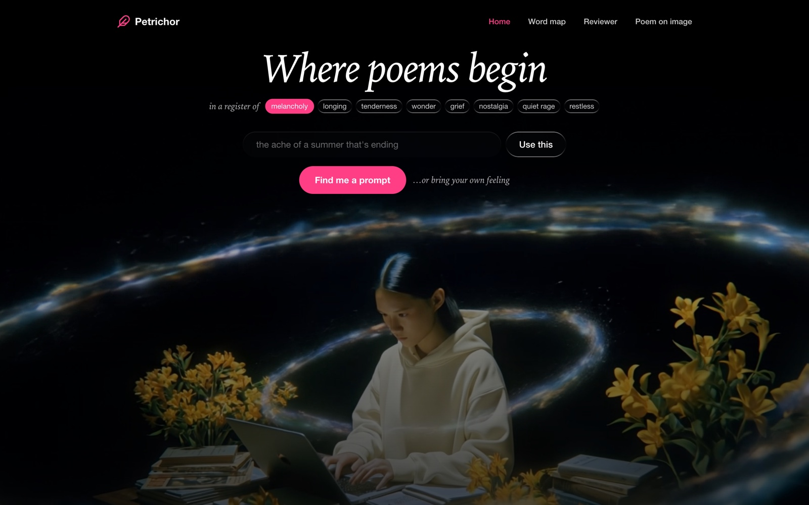
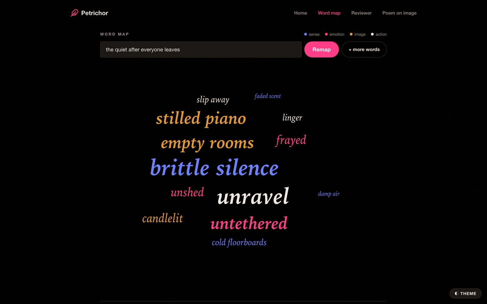
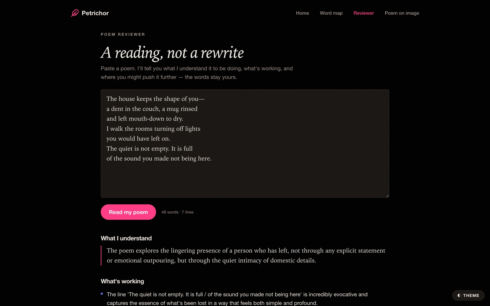
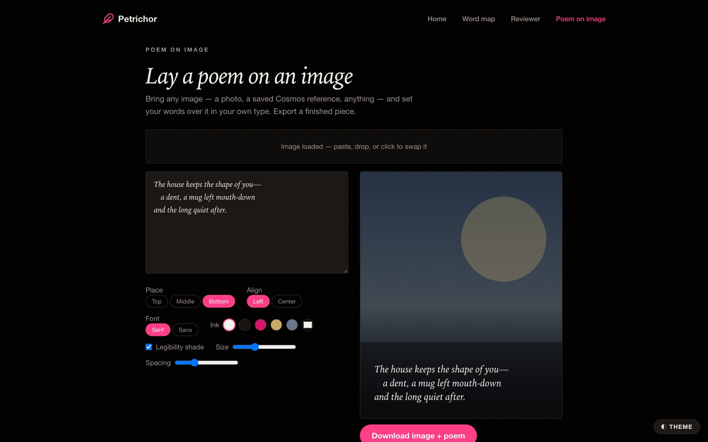

# Petrichor

**A companion for writing poems — never the author.**

*Petrichor* (n.) — the smell of rain on dry earth.

I write poetry, and the hardest part was never the writing. It was the blank page: showing up
with nothing to reach for. Petrichor is the tool I wanted — something that hands you a way in,
gathers the raw material around it, and then gets out of the way. It never writes the poem.



---

## What it does

You arrive, choose a register, and a prompt finds you. From there, four tools take you the rest
of the way — words to write with, images to look at, and a reader for when the poem exists.

### Word map — a feeling, mapped

Name what you're writing about and its vocabulary gathers into a spiral: biggest at the heart,
radiating outward. Words are **sized by charge** and **coloured by kind** — sense, emotion,
image, action — so you can see the shape of a feeling before you've written a line. Click any word
to keep and copy it. `+ more words` grows the same cloud without repeating what's already there.



### Reviewer — a reading, not a rewrite

Paste a finished poem and it tells you what it *understands* the poem to be doing, names what's
genuinely working, and points at places to push further. It is forbidden from rewriting your
lines. The words stay yours.



### Poem on image — set your words in type

Lay a poem over any image — a photo, a reference you saved, something you generated — and export a
finished piece. Real typography, not AI-rendered text: your line breaks and indentation are
preserved exactly, with control over placement, ink colour, size, leading, and a legibility scrim.



### Prompts → words → mood board

The path from the home page: a prompt, then **evocative words** for you and **concrete search
terms** to gather images with. Tap a term and the board fills with candidates you choose between —
every one carrying its creator and licence, so what you keep is yours to use. You can still hunt
anywhere you like ([Cosmos](https://www.cosmos.so) is one link away) and drop what you find in.
Then a vision model reads the whole board as a set and generates a new image in its spirit — with
the board's real palette locked into the prompt.

---

## How it works

```
feeling / prompt
   ↓  text model       →  prompts · evocative words · search terms · palette
   ↓  image search     →  licensed candidates; you pick (or bring your own)
   ↓  vision model     →  reads the mood board as a set, writes an image prompt
   ↓  diffusion        →  a new image in the board's spirit
   ↓  canvas           →  your poem, set in type, exported
```

**The LLM is pluggable.** One env var picks the provider, and every tool works the same across all
four:

| `MUSE_PROVIDER` | What it uses | Cost |
| --- | --- | --- |
| `groq` (default) | GPT-OSS 120B, open-weight, hosted on Groq | Free tier |
| `ollama` | Local Qwen3 14B, plus LLaVA for vision · also the automatic fallback | Free, offline, private |
| `gemini` | Gemini free tier | Free within limits |
| `anthropic` | Claude | Paid |

Image generation runs locally through **ComfyUI** (Stable Diffusion 1.5 / DreamShaper 8) — chosen
over FLUX deliberately: FLUX's ~12 GB checkpoint exhausted memory on an 18 GB machine, while SD 1.5
renders in ~30 s with room to spare.

All prompt engineering lives in one file — [`prompts.js`](prompts.js) — so the voice of every
engine can be tuned without touching the UI.

---

### Notion import

Books can be imported straight from Notion (**Books → Import from Notion**, or **From Notion** inside a
book). A page with sub-pages becomes a book whose chapters are those sub-pages; a page without them is split
at its headings. Line breaks, indents, bold/italic, quotes, lists and dividers come across.

1. Create an **internal** integration at [notion.so/profile/integrations](https://www.notion.so/profile/integrations)
   with **Read content** only, and copy its secret.
2. Set `NOTION_TOKEN` (that secret) and `NOTION_OWNER_EMAIL` (the email you sign in to Petrichor with) in `.env`
   and in Vercel → Settings → Environment Variables (Production).
3. In Notion, open each page you want → **•••** → **Connections** → add the integration. Sharing a parent page
   shares everything under it.

The server checks every Notion request against your Supabase session, so only that one account can read your
Notion through the app.

---

## Running it

```bash
npm install
cp .env.example .env      # add a key, or leave it and use local Ollama
npm run dev
```

Opens on `http://localhost:5174`, with the engine server on `8788`. Your API key stays
server-side — it is never exposed to the browser.

**For the free local setup:** install [Ollama](https://ollama.com), then `ollama pull qwen3:14b`
(text) and `ollama pull llava:7b` (mood-board vision). Image generation additionally needs
[ComfyUI](https://github.com/comfyanonymous/ComfyUI) running on `127.0.0.1:8188`. Every tool
degrades gracefully with a clear message if a service is down.

---

## Design notes

Petrichor is the **Verse** world of my personal brand system — poetry and prose, as distinct from
product work.

- **Type** — an italic Iowan serif for voice, a heavy grotesque for structure. The tension between
  them is the whole idea: poet meets product owner.
- **Colour** — ink and paper, with hot fuchsia as the single accent. Dark by default; a light theme
  is one toggle away and remembers your choice.
- **Motion** — fade + rise on `cubic-bezier(.22,1,.36,1)`, staggered ~80 ms apart, so sections feel
  continuous rather than switched.

One hard-won detail: every animation on the **visibility-critical path is CSS, not JavaScript**.
`requestAnimationFrame` stops firing while a page is hidden, which strands JS-driven animations
mid-flight — content stuck at `opacity: 0`, a transition frozen half-melted and unclickable. CSS
animations are wall-clock based, so they're simply finished when you look again. Motion that is
purely decorative can be JS; anything that could hide your content shouldn't be.

---

## Built with

React 18 · Vite · Tailwind CSS v4 · Framer Motion · Express · Ollama / Gemini / Claude · ComfyUI

---

*Part of [mahabaig.com](https://mahabaig.com) — Work, Verse, Field Notes.*
